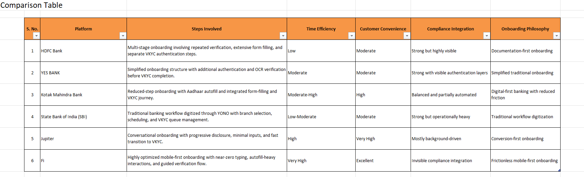
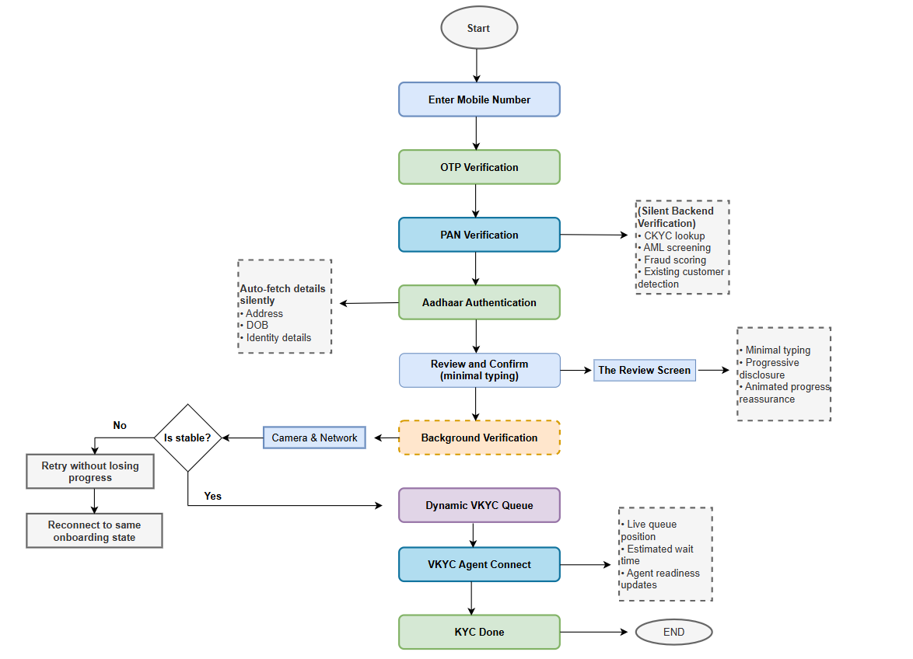
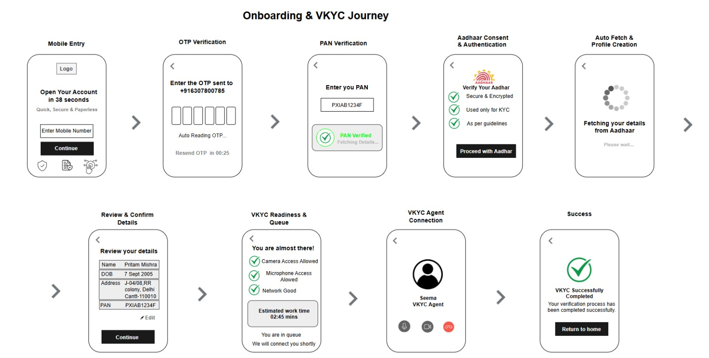

# Neo-Banking-VKYC-Onboarding-Optimization
Independent product case study exploring fintech onboarding optimization and VKYC workflow design, aimed at simulating real-world Product Manager decision-making and workflow structuring.

**The Problem** with the traditional onboarding journey invloves repetitive form filling, excessive manual typing, fragmented and repeated verification workflows, onboarding uncertainity and high user drop-off probability. Although these traditionals platforms are digitized, many systems still operate on compliance-heavy workflow. The compliance itself is not the problem. The problem is when compliance becomes operationally heavy and there is less focus on UX and conversion rate of customers. This project explores how fintech-first onboarding philosophies can improve onboarding efficiency while balancing operational requirements and compliance constraints.

**The research and comparative analysis** incuded the detailed study of workflow of user onboarding on traditional banking systems and fintech-based systems. The aim was to identify workflow inefficiencies, UX bottlenecks, and onboarding optimization opportunities. 

**Platforms analyzed:**

**Traditional Banks:**
  HDFC Bank,
  Yes Bank,
  Kotak Mahindra Bank and
  SBI (YONO).
  
**Fintech Platforms:**
  Jupiter,
  Fi.

The analysis revealed that the traditional systems primarily follow a compliance-first onboarding philosophy, whereas fintech platforms emphasize conversion-focused onboarding and reduced perceived effort. ## Comparative Analysis

**The key insights:** Several patterns consistently emerged across the onboarding systems analyzed.
For traditional banking systems it involves multiple onboarding screens, repetitive authentication and OTP requests, high manual typing effort, abrupt VKYC transitions weak onboarding continuity, poor queue transparency, operationally heavy workflows. On the other hand, for fintech-based systems the common pattern identified was progressive onboarding, conversational UX, smart defaults, autofill systems, inline validations, One-question-per-screen design, strong psychological reassurance, reduced visible friction. One of the strongest insights from the research was that fintech platforms optimize not only actual onboarding effort, but also perceived effort and onboarding psychology.

**The proposed product methodolgy** shall be focsed on fintech-firt onboarding philosophy while also mainataing the compliance integrity.  **The onboarding workflow** was redesigned to reduce interaction-heavy processes and simplify onboarding continuity while maintaining mandatory verification requirements.## Proposed Onboarding Workflow

The proposed flow focused on reducing unnecessary clicks, minimizing onboarding interruptions, reducing repetitive authentication, and improving onboarding guidance.

**Low-fidelity wireframes** were designed to visualize the onboarding journey and identify opportunities for friction reduction, onboarding continuity, simplified interactions, and improved onboarding speed perception.
The wireframes particularly focused on progressive onboarding, conversational interaction patterns, reduced cognitive load, and smooth transition into VKYC workflows. ## Wireframes

**Research Documentation:** Detailed onboarding observations, workflow analysis, friction analysis, and comparative research findings are included in the research documentation. ## Research Documentation

[View Detailed Research PDF](research/TraditionalBanksVSFintech.pdf)

**Key Learnings**
The project helped me to understand that the onboarding optimization is not just technical problem but also behavioural, psychological and operational design challenge. Some of the major learnings includes onboarding continuity significantly impacts completion rates, fintech onboarding succeeds by minimizing perceived effort, psychological reassurance strongly affects user confidence, queue transparency impacts abandonment probability, and small friction points compound into major onboarding drop-offs over time.

# Project Assets

| Asset | Link |
|---|---|
| Comparative Analysis | [View](assets/ComparisonTable.png) |
| Onboarding Workflow | [View](assets/OnboardingFlow.png) |
| Wireframes | [View](assets/TheWireframe.jpeg) |
| Research Documentation | [Open PDF](research/TraditionalBanksVSFintech.pdf) |
